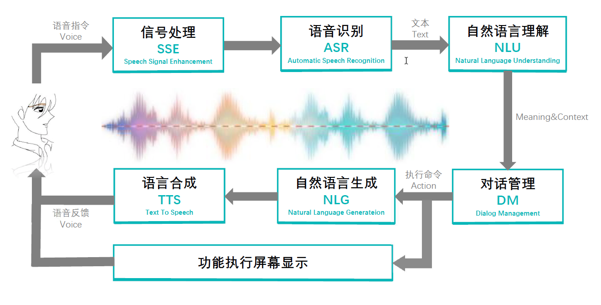
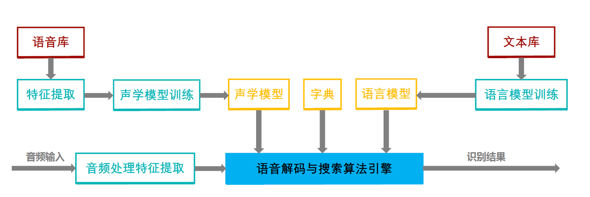

# 智能语音交互系统

## 信号处理SSE
回声消除AEC,噪声抑制,VAD语音活性检测
## ASR
实现音频到文本的转换

音素

状态，可以理解比音素更细致的语音单位，通常把一个音素划分3个状态

特征提取：信号处理与特征提取

语音设别就是把语音帧设别未状态，把状态组合成音素，把音素组成成单词。

声学模型：GMM(马尔科夫)，HMM(隐藏马尔科夫)

马尔科夫假设：未来的事件，只取决于前面的有限的历史，既假设当前词出现的概率只依赖于前面n-1个词。

语音模型

* 定义：对于一段自然语音序列，语音模型就是计算他的概率
* 机器学习角度：语音模型就是对语音的概率分布进行建模
* 通俗解释：判断一个语音序列是否正常语句，是否是人话。

